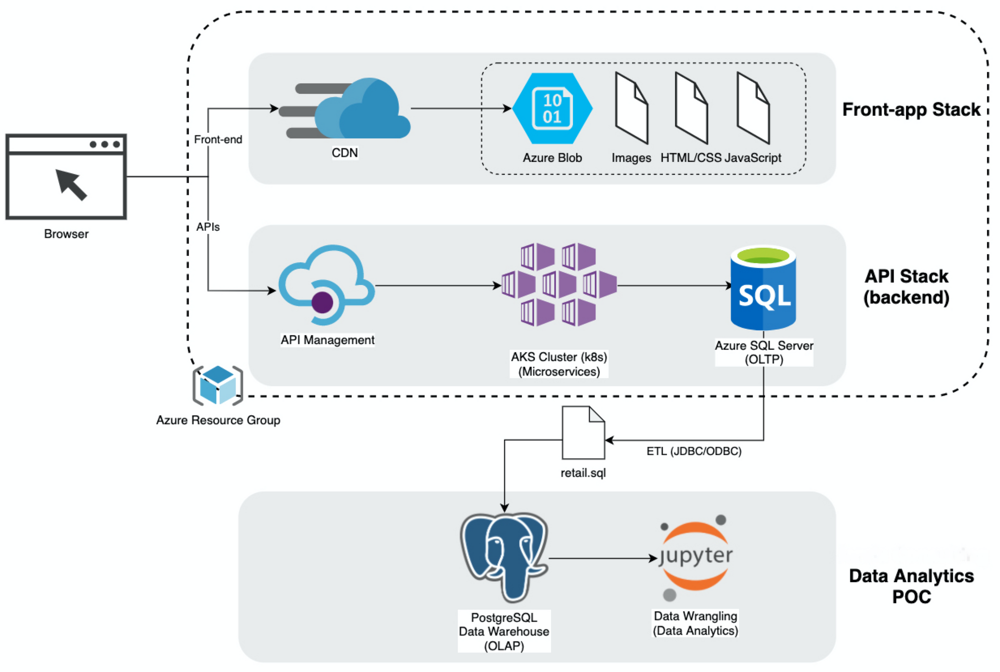
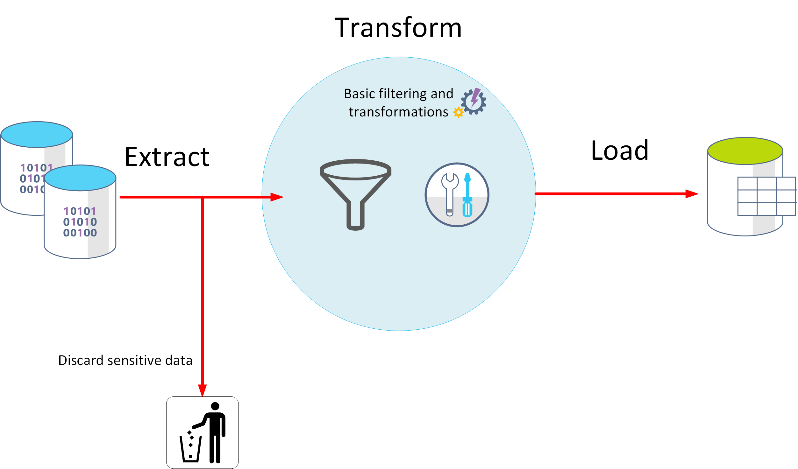

# Introduction
An online store that sells gift-ware and its customers are mainly wholesalers. In order to figure out why the revenue has not grown in recent years and understand their customers better. As a Data Engineer, I delivered a proof of concept project (PoC) that helps their marketing team by analyzing and visualizing customer shopping behaviour data. They can use those analytics to develop targeted marking campaigns (e.g. email, events, target promotions, etc..) to attract new and existing customers. 
 
The data is stored in a PostgreSQL database which is provisioned using a docker container, and it is connected to the Jupyter Notebook to perform analyses. Pandas, NumPy, and MatPlotLib libraries are used to wrangle the dataset as well as display the results. 

Technolgies that been used:

  * PostgreSQL 
  * Jupyter Notebook
  * Pandas & Numpy & Matplotlib
  * Data Warehouse
  * Data Analytics and Visualization

# Implementaion
## Project Architecture

The high-level system design diagram is as below. The front-end consists of a Cloud Content Delivery Network and Azure Blob, which are used to store and deploy their HTML/CSS/JS. 

The backend API is used to store transaction data in Azure SQL Server, it consists of a bunch of microservices. The OnLine Transactional Processing (OLTP) is completed through Azure SQL Server and The data eventually load into a retail.sql file through ETL process. 

As per request, the IT team dumped the transaction data into a SQL file, and personal information has been removed through ETL process. 

We then store the sql file into our PostgreSQL data warehouse, it uses OnLine Analytical Processing (OLAP) to analyze massive volumes of data rapidly. Finally, we are ready to use Jupyter notebook to connect the PostgreSQL Database to do the data analytics. 

---

  
>**system design diagram**

---

>**ETL**
## Data Analytics and Wrangling

The link to the Jupyter Notebook Project: [retail_data_analytics.ipynb](./retail_data_analytics.ipynb)

We can develop a marketing strategy by presenting data from the following aspects：  
- Total Invoice Amount Distribution  
- Monthly Placed and Canceled Orders  
- Montly Sales  
- Monthly Sales Growth  
- Montly Acitve Users  
- New Uers vs Existing Users  

RFM method is also been used for analyzing customer value. And we can make different marketing strategies based on different RFM segments. Here are some segements I think need to be paid attention to.

* “Cat’t lost”   
The marketing team should pay close attention to "Can't Lost" Segment customers, Although their share is small, they contribute a lot to the company's overall earnings and their recency values are lower than they should be. The LGS can provide special discount for them or win them back via renewals or newer products, it's necessary to investigate what causes the less activities of these customers.

* "Hibernating"  
Customers in this segment have not made a purchase for a long time. However, by offering discounts, they may be attracted to another purchase.

* "Champions"  
Customers in this segment are responsible for most of the revenue. They can be early adopters of new products. Most likely to send referrals. Most of them are likely statisfy the product so asking for reviews may be a good way to promote the brand. Therefore, Campaigns should be implemented to ensure the continuity of the shopping of these customers. For example, rewarding them regularly.

* "At risk"   
The group of this segment is not small, but It's been a long time since they last bought anything. They also make a big contribution to the revenue.Try to attarct them back through giving discounts or other types of promotions.

# Improvements
1. Could use a pie chart to visualize the RFM segments, making it more intuitive.
2. Try to acquire the values of missing data(NaNs) or impute replacement values to make the data more complete.
3. Do statistics analysis on other sides of the data, like the product popularity, the customer location distribution, etc.
4. Could apply some machine learning techniques to the dataset, to do some predictions and classifications.

